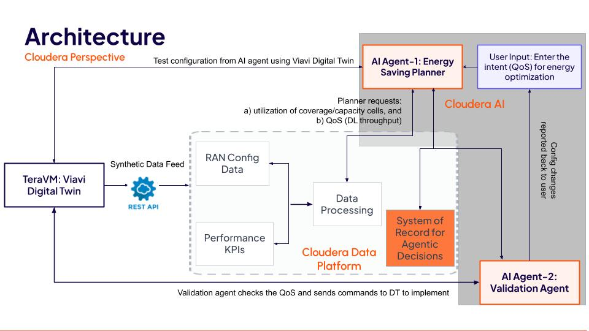

# Intent-Based RAN Energy Efficiency Blueprint

Closed-Loop RAN Energy Optimization using VIAVI TeraVM AI RAN Scenario Generator (AI RSG) and Cloudera AI Model Endpoints

> **Based on** the original [NVIDIA Intent-Based RAN Energy Efficiency Blueprint](https://github.com/VIAVI-CTOO/es-blueprint-rsg) by VIAVI Solutions and NVIDIA, adapted to use [Cloudera AI](https://www.cloudera.com/products/machine-learning.html) for LLM hosting via an OpenAI-compatible inference endpoint.

## Table of Contents

- [Overview](#overview)
- [Problem Statement](#problem-statement)
- [System Architecture](#system-architecture)
- [Agent Architecture](#agent-architecture)
  - [Planner Agent](#planner-agent)
  - [Validation Agent](#validation-agent)
- [Closed-Loop Execution Flow](#closed-loop-execution-flow)
- [Repository Structure](#repository-structure)
- [Requirements](#requirements)
- [Setup Instructions](#setup-instructions)
- [Running the Notebook](#running-the-notebook)
- [Operator Intent Input](#operator-intent-input)
- [Output](#output)
- [Troubleshooting](#troubleshooting)
- [Purpose](#purpose)
- [Contributors](#contributors)
- [Disclaimer](#disclaimer)

## Overview

The Intent-Based RAN Energy Efficiency Blueprint provides a simulation-validated framework for evaluating AI-driven energy optimization strategies in 5G Radio Access Networks (RAN).

This blueprint integrates:
- VIAVI RAN Scenario Generator (AI RSG)
- VIAVI ADK simulation environment
- Cloudera AI-hosted Large Language Models via an OpenAI-compatible inference endpoint
- Closed-loop Planner and Validation agent architecture

The system simulates network behavior, generates energy-saving actions, validates those actions against QoS constraints, and applies safe optimizations iteratively.

This enables engineering teams to evaluate AI-assisted network control policies before deployment.


## Problem Statement

Reducing RAN energy consumption while maintaining strict Quality of Service (QoS) guarantees is a critical engineering challenge.

Aggressive energy-saving techniques, such as cell sleeping, can negatively impact throughput and user experience if applied incorrectly.

This blueprint evaluates AI-generated energy optimization actions in a validated simulation loop to ensure:
- Energy efficiency improvements
- QoS preservation
- Safe and controlled optimization

## System Architecture



The system operates as a closed-loop optimization pipeline:

```
UEReports + CellReports
        |
        v
KPI Processing Layer
        |
        v
State Store (SQL + LoopState)
        |
        v
Planner Agent (LLM)
  Generate energy-saving actions
        |
        v
AI RSG Simulation
  Evaluate impact of proposed actions
        |
        v
Validation Agent (LLM)
  Approve / reject / modify actions
        |
        v
AI RSG Simulation 
  Apply approved actions
        |
        v
Updated Network State 
        |
        v
Next Iteration
```

Each iteration represents one simulation interval.

## Agent Architecture

### Planner Agent

The Planner Agent generates candidate energy-saving actions.

**Inputs:**
- Network KPIs
- Cell activity and sleep state
- Throughput and utilization
- Operator intent
- QoS constraints

**Output:**
- Proposed sleep/wake actions

**Objective:**

Maximize energy efficiency while maintaining QoS.

### Validation Agent

The Validation Agent ensures safety and QoS compliance.

**Responsibilities:**
- Evaluate Planner recommendations
- Reject unsafe or QoS-violating actions
- Approve valid actions
- Ensure network stability

The Validation Agent acts as a safety layer.

## Closed-Loop Execution Flow

Each iteration performs:

1. Load network state and KPIs
2. Generate candidate actions using Planner Agent
3. Simulate proposed actions using VIAVI AI RSG
4. Validate actions using Validation Agent
5. Apply validated actions
6. Record KPIs and system state
7. Advance simulation time

This creates a validated continuous optimization loop.

## Repository Structure

```
es-blueprint-rsg/
│
├── notebooks/
│   └── es_blueprint_poc.ipynb      # Main PoC notebook
│
├── data/
│   ├── UEReports.csv
│   └── CellReports.csv
│
├── ai_rsg_config/
│   └── config.conf
│
├── output/                         # Simulation results (gitignored)
│
├── .env.example
├── requirements.txt
├── setup.sh
├── run.sh
└── README.md
```

## Requirements

- Python 3.10 or newer
- Jupyter Notebook or Jupyter Lab
- Access to a VIAVI AI RSG instance
- A running Cloudera AI model endpoint (any OpenAI-compatible LLM)

### Supported models

Any model deployed on Cloudera AI Inference Service works. Tested with:

| Model | Parameters | Notes |
|---|---|---|
| `nvidia/nemotron-3-super-120b-a12b` | 120B MoE | Best recommendation precision |
| `Qwen/Qwen2.5-7B-Instruct` | 7B | Lightweight, good energy outcomes |
| `Qwen/Qwen2.5-Coder-7B-Instruct` | 7B | Code-tuned; strong SQL generation |

## Setup Instructions

### 1. Clone the repository

```bash
git clone https://github.com/athpra/intent-based-ran-energy-optimization.git
cd intent-based-ran-energy-optimization
```

### 2. Run setup script

```bash
./setup.sh
```

This creates a virtual environment and installs dependencies.

Activate environment:

```bash
source .venv/bin/activate
```

Install VIAVI ADK package (requires authorized access):

```bash
pip install http://3.211.96.252:8000/adk
```

### 3. Configure Cloudera AI credentials

Copy the example file and fill in your values:

```bash
cp .env.example .env
```

Edit `.env`:

```
CDSW_API_URL=https://<your-cml-domain>/namespaces/serving-default/endpoints/<endpoint-name>/v1
CDSW_API_KEY=<your-api-key>
LLM_MODEL=Qwen/Qwen2.5-Coder-7B-Instruct
```

**Getting `CDSW_API_URL`:** Cloudera AI → AI Inference Service → click your endpoint → copy the Endpoint URL (add `/v1` suffix if not present).

**Getting `CDSW_API_KEY`:** In a CML workbench terminal run `echo $CDSW_APIV2_KEY`, or go to CML UI → User Settings → API Keys → Create API Key.

| Variable | Description |
|---|---|
| `CDSW_API_URL` | Full URL of the Cloudera AI model endpoint (`/v1` suffix required) |
| `CDSW_API_KEY` | Cloudera AI API key for the endpoint |
| `LLM_MODEL` | Model name as registered in the endpoint |

> **On Cloudera ML Workbench:** the notebook will also try to read a fresh token from `/tmp/jwt` (auto-refreshed by the platform) before falling back to the `.env` key — so tokens stay valid across long simulation runs.

## Running the Notebook

Launch Jupyter:

```bash
./run.sh
```

Open:

```
notebooks/es_blueprint_poc.ipynb
```

Run all cells sequentially.

### Expected Successful Startup Output

You should see:

```
✓ Credentials configured (.env found)
✓ LLM sanity check passed (model: Qwen/Qwen2.5-Coder-7B-Instruct)
```

If these messages appear, the system is correctly configured.

## Operator Intent Input

The notebook accepts operator QoS intent. Examples:

```
Keep QoS above 5 Mbps
>= 4.5 Mbps
6 Mbps
5
```

## Output

Each run creates a timestamped folder under `output/run_<timestamp>_<model>/` containing:

- `closed_loop.txt` — full iteration log with timings and decisions
- `summary.csv` — per-iteration KPI summary (sleeping cells, throughput, latency)
- `*.parquet` — structured data for downstream analysis

These results allow engineers to evaluate optimization strategies across models and configurations.

## Troubleshooting

### LLM sanity check failed — 401 Unauthorized

**Cause:**
Missing or expired API key.

**Solution:**

- In a CML terminal, refresh the key in `.env`:

```bash
python3 -c "
import re, os
key = os.environ.get('CDSW_APIV2_KEY','').strip()
txt = open('/home/cdsw/.env').read()
txt = re.sub(r'^CDSW_API_KEY=.*', f'CDSW_API_KEY={key}', txt, flags=re.MULTILINE)
open('/home/cdsw/.env','w').write(txt)
print(f'Updated ({len(key)} chars)')
"
```

- Restart the kernel and re-run all cells.

### LLM sanity check failed — 503 Service Unavailable

**Cause:**
The model endpoint is stopped or the vLLM backend process is not running.

**Solution:**

- Go to **CML → AI Inference Service** → find the endpoint → **Restart**.
- Wait 2–5 minutes for model weights to load, then re-run.

### LLM sanity check failed — model not found

**Cause:**
`LLM_MODEL` in `.env` does not match the model name registered in the endpoint.

**Solution:**

- Check the exact model name shown in CML → AI Inference Service → your endpoint.
- Update `LLM_MODEL` in `.env` to match exactly, then restart the kernel.

### Missing data files

Ensure these files exist:

```
data/UEReports.csv
data/CellReports.csv
```

## Purpose

This blueprint provides a research and engineering framework for:

- Evaluating AI-driven energy optimization
- Testing network control policies safely
- Simulating RAN energy optimization scenarios
- Validating AI-assisted network automation

## Contributors

**Original blueprint (VIAVI Solutions & NVIDIA):**

1. [Bimo Fransiscus](https://www.linkedin.com/in/fransiscusbimo/) — CTO Office, VIAVI Solutions
2. [Mahdi Sharara](https://www.linkedin.com/in/mahdisharara/) — CTO Office, VIAVI Solutions
3. [Georgy Myagkov](https://www.linkedin.com/in/georgy-myagkov-03a2486) — Wireless R&D, VIAVI Solutions
4. [Ari Uskudar](https://www.linkedin.com/in/ari-u-628b30148/) — NVIDIA

For blueprint related questions: IB_ES_blueprint@viavisolutions.com

**Cloudera AI adaptation:**

5. [Athul Prasad](https://www.linkedin.com/in/athul-prasad/) — Applied AI, Cloudera

## Disclaimer

*This Intent-Based RAN Energy Efficiency blueprint is intended for Proof-of-Concept and research use only. It is not designed for production deployment. Use in production environments is at the user's own risk. The authors and contributors accept no liability for operational impacts or damages.*
